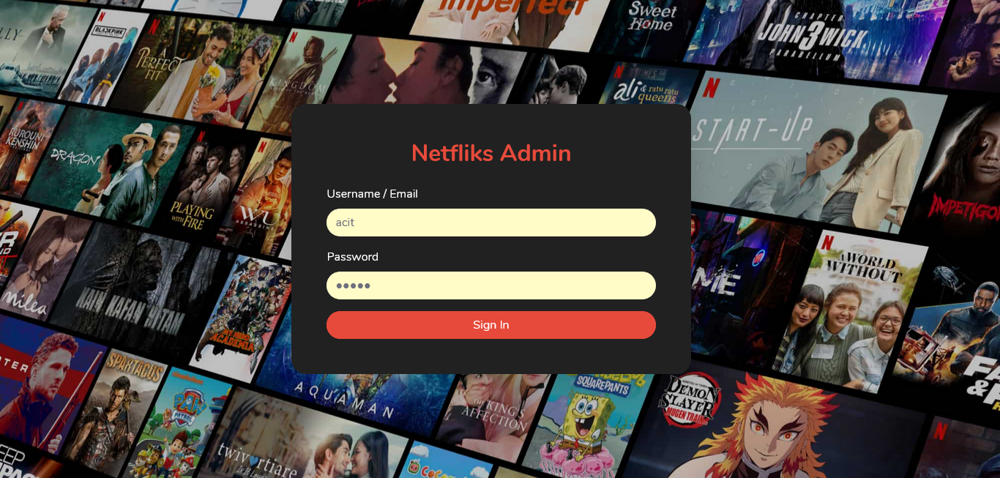
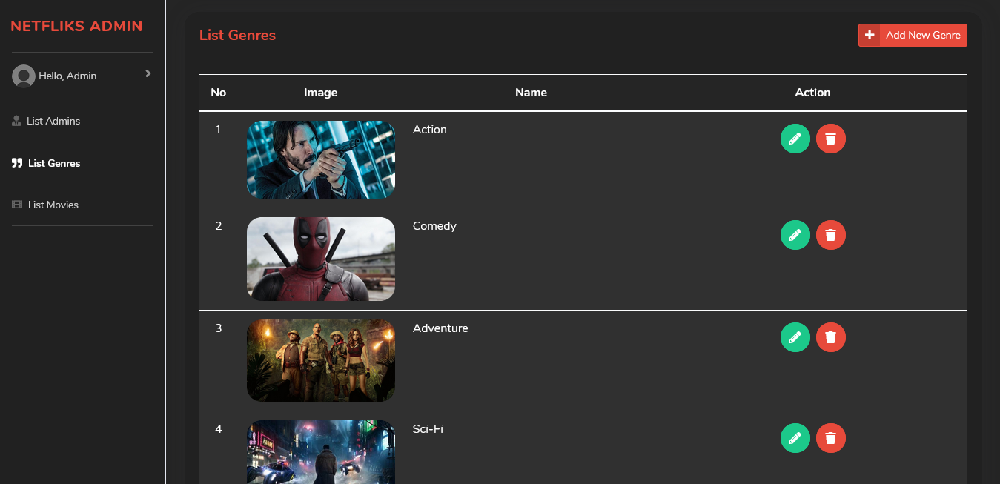
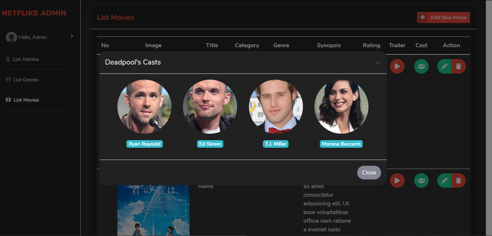
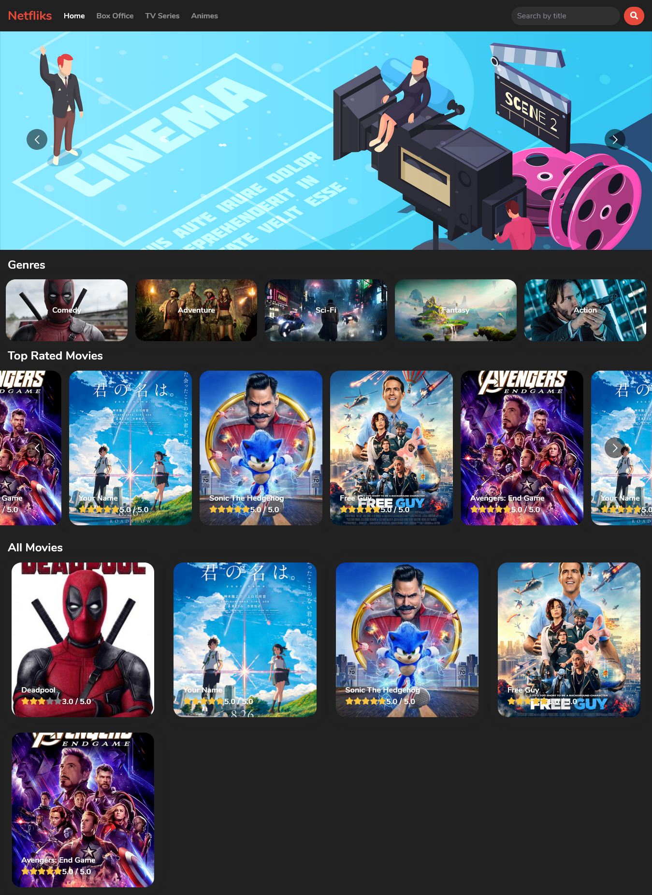

## Deploy links:

- Server (Heroku): https://netfliks-api.herokuapp.com
- Client-Admin (Firebase): https://netfliks-cms.web.app

  > **Admin account**
  > email: acit@mail.com / username: acit
  > password: 12345

- Client-User (Firebase): https://my-netfliks.web.app

# Update

Since Heroku updated its term and condition (free to paid), server on Heroku is no longer working as it should. If you need a demo, i can demo it on my local. Here some screenshots of this project:

1. Admin login page
   

2. Admin list
   

3. Register admin
   

4. Genre list
   

5. Add genre
   

6. Movie list
   

7. Movie Cast
   

8. Add movie
   

9. Home user
   

10. Movie detail
    
